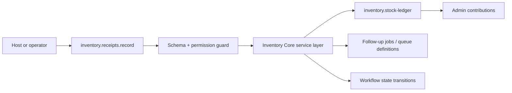
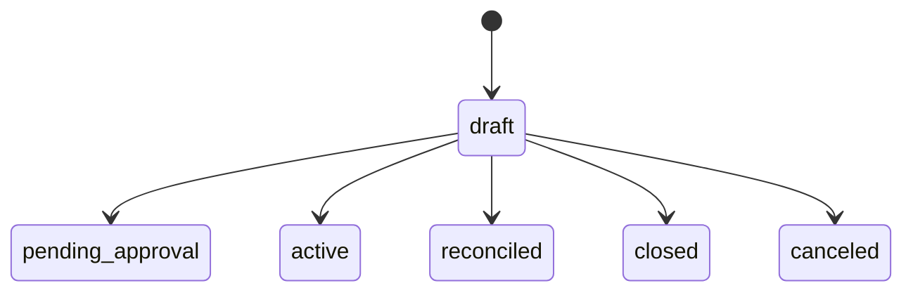

# Inventory Core Developer Guide

Warehouse truth, stock ledger state, reservation visibility, transfer execution, and physical reconciliation for inventory-controlled operations.

**Maturity Tier:** `Hardened`

## Purpose And Architecture Role

Owns physical stock, reservations, transfers, and reconciliation state so warehouse truth remains explicit and durable.

### This plugin is the right fit when

- You need **stock truth**, **reservations**, **movement reconciliation** as a governed domain boundary.
- You want to integrate through declared actions, resources, jobs, workflows, and UI surfaces instead of implicit side effects.
- You need the host application to keep plugin boundaries honest through manifest capabilities, permissions, and verification lanes.

### This plugin is intentionally not

- Not a full vertical application suite; this plugin only owns the domain slice exported in this repo.
- Not a replacement for explicit orchestration in jobs/workflows when multi-step automation is required.

## Repo Map

| Path | Purpose |
| --- | --- |
| `package.json` | Root extracted-repo manifest, workspace wiring, and repo-level script entrypoints. |
| `framework/builtin-plugins/inventory-core` | Nested publishable plugin package. |
| `framework/builtin-plugins/inventory-core/src` | Runtime source, actions, resources, services, and UI exports. |
| `framework/builtin-plugins/inventory-core/tests` | Unit, contract, integration, and migration coverage where present. |
| `framework/builtin-plugins/inventory-core/docs` | Internal domain-doc source set kept in sync with this guide. |
| `framework/builtin-plugins/inventory-core/db/schema.ts` | Database schema contract when durable state is owned. |
| `framework/builtin-plugins/inventory-core/src/postgres.ts` | SQL migration and rollback helpers when exported. |

## Manifest Contract

| Field | Value |
| --- | --- |
| Package Name | `@plugins/inventory-core` |
| Manifest ID | `inventory-core` |
| Display Name | Inventory Core |
| Domain Group | Operational Data |
| Default Category | Business / Inventory & Warehouse |
| Version | `0.1.0` |
| Kind | `plugin` |
| Trust Tier | `first-party` |
| Review Tier | `R1` |
| Isolation Profile | `same-process-trusted` |
| Framework Compatibility | ^0.1.0 |
| Runtime Compatibility | bun>=1.3.12 |
| Database Compatibility | postgres, sqlite |

## Dependency Graph And Capability Requests

| Field | Value |
| --- | --- |
| Depends On | `auth-core`, `org-tenant-core`, `role-policy-core`, `audit-core`, `workflow-core`, `product-catalog-core`, `traceability-core` |
| Recommended Plugins | `sales-core`, `procurement-core`, `accounting-core` |
| Capability Enhancing | `manufacturing-core`, `quality-core`, `pos-core`, `support-service-core` |
| Integration Only | `business-portals-core` |
| Suggested Packs | `sector-ecommerce`, `sector-healthcare`, `sector-manufacturing`, `sector-retail`, `sector-trading-distribution` |
| Standalone Supported | Yes |
| Requested Capabilities | `ui.register.admin`, `api.rest.mount`, `data.write.inventory`, `events.publish.inventory` |
| Provides Capabilities | `inventory.stock-ledger`, `inventory.reservations`, `inventory.transfers` |
| Owns Data | `inventory.stock-ledger`, `inventory.reservations`, `inventory.transfers`, `inventory.reconciliation` |

### Dependency interpretation

- Direct plugin dependencies describe package-level coupling that must already be present in the host graph.
- Requested capabilities tell the host what platform services or sibling plugins this package expects to find.
- Provided capabilities and owned data tell integrators what this package is authoritative for.

## Public Integration Surfaces

| Type | ID / Symbol | Access / Mode | Notes |
| --- | --- | --- | --- |
| Action | `inventory.receipts.record` | Permission: `inventory.stock-ledger.write` | Record Inventory Receipt<br>Idempotent<br>Audited |
| Action | `inventory.reservations.allocate` | Permission: `inventory.reservations.write` | Allocate Reservation<br>Non-idempotent<br>Audited |
| Action | `inventory.transfers.request` | Permission: `inventory.transfers.write` | Request Stock Transfer<br>Non-idempotent<br>Audited |
| Action | `inventory.receipts.hold` | Permission: `inventory.stock-ledger.write` | Place Record On Hold<br>Non-idempotent<br>Audited |
| Action | `inventory.receipts.release` | Permission: `inventory.stock-ledger.write` | Release Record Hold<br>Non-idempotent<br>Audited |
| Action | `inventory.receipts.amend` | Permission: `inventory.stock-ledger.write` | Amend Record<br>Non-idempotent<br>Audited |
| Action | `inventory.receipts.reverse` | Permission: `inventory.stock-ledger.write` | Reverse Record<br>Non-idempotent<br>Audited |
| Resource | `inventory.stock-ledger` | Portal disabled | Inventory-ledger records for on-hand, in-transit, and quality-segregated stock.<br>Purpose: Keep physical truth authoritative inside the inventory boundary.<br>Admin auto-CRUD enabled<br>Fields: `title`, `recordState`, `approvalState`, `postingState`, `fulfillmentState`, `updatedAt` |
| Resource | `inventory.reservations` | Portal disabled | Reservation and allocation records linked to downstream demand.<br>Purpose: Expose promise and allocation state without letting upstream demand mutate stock balances directly.<br>Admin auto-CRUD enabled<br>Fields: `label`, `status`, `requestedAction`, `updatedAt` |
| Resource | `inventory.transfers` | Portal disabled | Internal transfer and movement records with discrepancy visibility.<br>Purpose: Make multi-branch and multi-warehouse movement state durable and auditable.<br>Admin auto-CRUD enabled<br>Fields: `severity`, `status`, `reasonCode`, `updatedAt` |

### Job Catalog

| Job | Queue | Retry | Timeout |
| --- | --- | --- | --- |
| `inventory.projections.refresh` | `inventory-projections` | Retry policy not declared | No timeout declared |
| `inventory.reconciliation.run` | `inventory-reconciliation` | Retry policy not declared | No timeout declared |


### Workflow Catalog

| Workflow | Actors | States | Purpose |
| --- | --- | --- | --- |
| `inventory-movement-lifecycle` | `warehouse`, `approver`, `controller` | `draft`, `pending_approval`, `active`, `reconciled`, `closed`, `canceled` | Keep physical movement, reservation, and reconciliation logic explicit through partial and discrepancy-heavy flows. |


### UI Surface Summary

| Surface | Present | Notes |
| --- | --- | --- |
| UI Surface | Yes | A bounded UI surface export is present. |
| Admin Contributions | Yes | Additional admin workspace contributions are exported. |
| Zone/Canvas Extension | No | No dedicated zone extension export. |

## Hooks, Events, And Orchestration

This plugin should be integrated through **explicit commands/actions, resources, jobs, workflows, and the surrounding Gutu event runtime**. It must **not** be documented as a generic WordPress-style hook system unless such a hook API is explicitly exported.

- No standalone plugin-owned lifecycle event feed is exported today.
- Job surface: `inventory.projections.refresh`, `inventory.reconciliation.run`.
- Workflow surface: `inventory-movement-lifecycle`.
- Recommended composition pattern: invoke actions, read resources, then let the surrounding Gutu command/event/job runtime handle downstream automation.

## Storage, Schema, And Migration Notes

- Database compatibility: `postgres`, `sqlite`
- Schema file: `framework/builtin-plugins/inventory-core/db/schema.ts`
- SQL helper file: `framework/builtin-plugins/inventory-core/src/postgres.ts`
- Migration lane present: Yes

The plugin ships explicit SQL helper exports. Use those helpers as the truth source for database migration or rollback expectations.

## Failure Modes And Recovery

- Action inputs can fail schema validation or permission evaluation before any durable mutation happens.
- If downstream automation is needed, the host must add it explicitly instead of assuming this plugin emits jobs.
- There is no separate lifecycle-event feed to rely on today; do not build one implicitly from internal details.
- Schema regressions are expected to show up in the migration lane and should block shipment.

## Mermaid Flows

### Primary Lifecycle



### Workflow State Machine




## Integration Recipes

### 1. Host wiring

```ts
import { manifest, recordInventoryReceiptAction, BusinessPrimaryResource, jobDefinitions, workflowDefinitions, adminContributions, uiSurface } from "@plugins/inventory-core";

export const pluginSurface = {
  manifest,
  recordInventoryReceiptAction,
  BusinessPrimaryResource,
  jobDefinitions,
  workflowDefinitions,
  adminContributions,
  uiSurface
};
```

Use this pattern when your host needs to register the plugin’s declared exports without reaching into internal file paths.

### 2. Action-first orchestration

```ts
import { manifest, recordInventoryReceiptAction } from "@plugins/inventory-core";

console.log("plugin", manifest.id);
console.log("action", recordInventoryReceiptAction.id);
```

- Prefer action IDs as the stable integration boundary.
- Respect the declared permission, idempotency, and audit metadata instead of bypassing the service layer.
- Treat resource IDs as the read-model boundary for downstream consumers.

### 3. Cross-plugin composition

- Register the workflow definitions with the host runtime instead of re-encoding state transitions outside the plugin.
- Drive follow-up automation from explicit workflow transitions and resource reads.
- Pair workflow decisions with notifications or jobs in the outer orchestration layer when humans must be kept in the loop.

## Test Matrix

| Lane | Present | Evidence |
| --- | --- | --- |
| Build | Yes | `bun run build` |
| Typecheck | Yes | `bun run typecheck` |
| Lint | Yes | `bun run lint` |
| Test | Yes | `bun run test` |
| Unit | Yes | 1 file(s) |
| Contracts | Yes | 1 file(s) |
| Integration | Yes | 1 file(s) |
| Migrations | Yes | 2 file(s) |

### Verification commands

- `bun run build`
- `bun run typecheck`
- `bun run lint`
- `bun run test`
- `bun run test:contracts`
- `bun run test:unit`
- `bun run test:integration`
- `bun run test:migrations`
- `bun run docs:check`

## Current Truth And Recommended Next

### Current truth

- Exports 7 governed actions: `inventory.receipts.record`, `inventory.reservations.allocate`, `inventory.transfers.request`, `inventory.receipts.hold`, `inventory.receipts.release`, `inventory.receipts.amend`, `inventory.receipts.reverse`.
- Owns 3 resource contracts: `inventory.stock-ledger`, `inventory.reservations`, `inventory.transfers`.
- Publishes 2 job definitions with explicit queue and retry policy metadata.
- Publishes 1 workflow definition with state-machine descriptions and mandatory steps.
- Adds richer admin workspace contributions on top of the base UI surface.
- Ships explicit SQL migration or rollback helpers alongside the domain model.
- Documents 8 owned entity surface(s): `Warehouse`, `Location`, `Stock Ledger`, `Reservation`, `Transfer`, `Pick Wave`, and more.
- Carries 6 report surface(s) and 4 exception queue(s) for operator parity and reconciliation visibility.
- Tracks ERPNext reference parity against module(s): `Stock`.
- Operational scenario matrix includes `receipt-to-putaway`, `reservation-to-pick-pack-ship`, `transfer-in-transit`, `cycle-count-and-recount`.
- Governs 3 settings or policy surface(s) for operator control and rollout safety.

### Current gaps

- No extra gaps were discovered beyond the plugin’s declared boundaries.

### Recommended next

- Deepen warehouse execution, counting, and discrepancy handling before more downstream operational flows depend on inventory truth.
- Add stronger negative-stock, transfer, and quality-state enforcement where physical operations become denser.
- Broaden lifecycle coverage with deeper orchestration, reconciliation, and operator tooling where the business flow requires it.
- Add more explicit domain events or follow-up job surfaces when downstream systems need tighter coupling.
- Convert more ERP parity references into first-class runtime handlers where needed, starting from `Warehouse`, `Bin`, `Batch`.

### Later / optional

- Outbound connectors, richer analytics, or portal-facing experiences once the core domain contracts harden.
